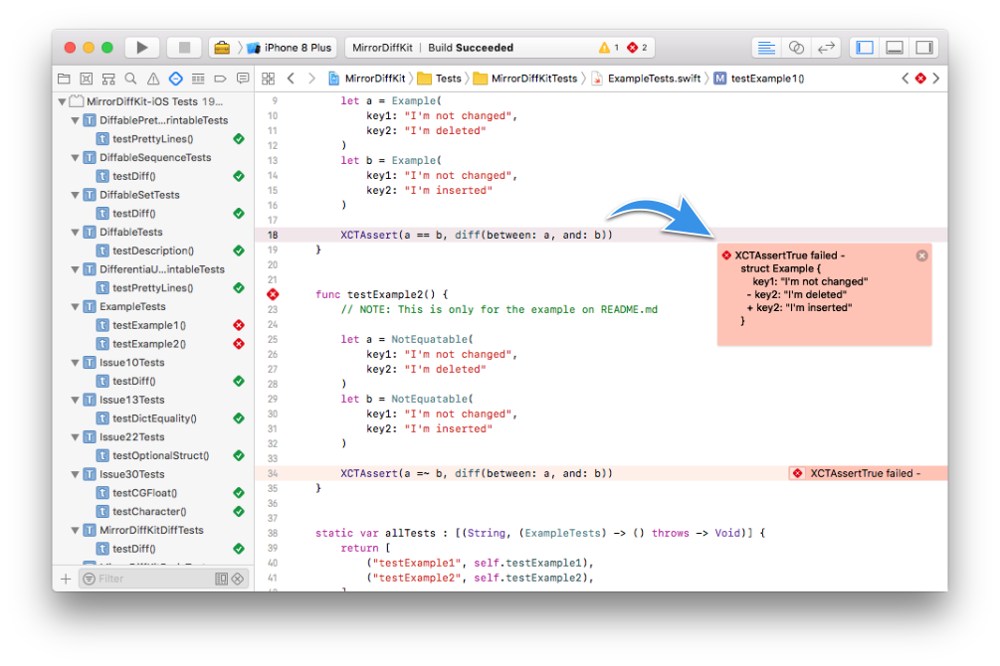

=============


[](https://cocoapods.org/pods/MirrorDiffKit)
[](https://github.com/Kuniwak/MirrorDiffKit/releases/latest)
[](https://github.com/Kuniwak/MirrorDiffKit/releases/latest)
[](https://github.com/Kuniwak/MirrorDiffKit/blob/master/LICENSE)
[](https://app.bitrise.io/app/94e8fe199a9a670b)


A tool for providing the 2 features for efficient testing:

- Output diff between 2 any types
- Default implementation of Equatable for any types





Usage
-----

### `diff(between: Any, and: Any)`

```swift
import MirrorDiffKit

// Input 2 structs or classes implements Equatable:
let a = Example(
    key1: "I'm not changed",
    key2: "I'm deleted"
)
let b = Example(
    key1: "I'm not changed",
    key2: "I'm inserted"
)


XCTAssertEqual(a, b, diff(between: a, and: b))

// XCTAssertEqual failed: ("Example(key1: "I\'m not changed", key2: "I\'m deleted")") is not equal to ("Example(key1: "I\'m not changed", key2: "I\'m inserted")") - 
//     struct Example {
//         key1: "I'm not changed"
//       - key2: "I'm deleted"
//       + key2: "I'm inserted"
//     }
```


### `Any =~ Any` and `Any !~ Any`

```swift
import MirrorDiffKit

a = NotEquatable(
    key1: "I'm not changed",
    key2: "I'm deleted"
)
b = NotEquatable(
    key1: "I'm not changed",
    key2: "I'm inserted"
)


XCTAssert(a =~ b, diff(between: a, and: b))

// XCTAssertTrue failed - 
//     struct NotEquatable {
//         key1: "I'm not changed"
//       - key2: "I'm deleted"
//       + key2: "I'm inserted"
//     }
```


Installation
------------
### Swift Package Manager

Add the following line to your `Package.swift`:


```
.Package(url: "https://github.com/Kuniwak/MirrorDiffKit.git")
```


### Carthage

Add the following line to your `Cartfile`:

```
github "Kuniwak/MirrorDiffKit"
```


### CocoaPods

```ruby
pod "MirrorDiffKit"
```
